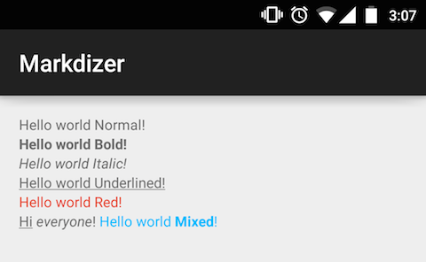

# Markdizer
Span your texts of TextViews easily.

# Usage
You can span your texts with ``` ` ```, `*`, `/`, `_`, and `#`.
- Bold : ``` `*blah blah*` ```
- Italic : ``` `/blah blah/` ```
- Underline : ``` `_blah blah_` ```
- Font Color : ``` `ffffff#blah blah#` ```
- Mixed : ``` `e74c3c#This is `*bold*` text#` ```

Then the Markdizer converts your texts like:
- `<b>blah blah</b>`
- `<i>blah blah</i>`
- `<u>blah blah</u>`
- `<font color="#ffffff">blah blah</font>`

# Example
```java
CharSequence target = "`*Hello World!*`";
TextView tv = new TextView(context);
tv.setText(Markdizer.markdize(target));
```


# License
```
The MIT License (MIT)

Copyright (c) 2015 Minsoo Park

Permission is hereby granted, free of charge, to any person obtaining a copy
of this software and associated documentation files (the "Software"), to deal
in the Software without restriction, including without limitation the rights
to use, copy, modify, merge, publish, distribute, sublicense, and/or sell
copies of the Software, and to permit persons to whom the Software is
furnished to do so, subject to the following conditions:

The above copyright notice and this permission notice shall be included in all
copies or substantial portions of the Software.

THE SOFTWARE IS PROVIDED "AS IS", WITHOUT WARRANTY OF ANY KIND, EXPRESS OR
IMPLIED, INCLUDING BUT NOT LIMITED TO THE WARRANTIES OF MERCHANTABILITY,
FITNESS FOR A PARTICULAR PURPOSE AND NONINFRINGEMENT. IN NO EVENT SHALL THE
AUTHORS OR COPYRIGHT HOLDERS BE LIABLE FOR ANY CLAIM, DAMAGES OR OTHER
LIABILITY, WHETHER IN AN ACTION OF CONTRACT, TORT OR OTHERWISE, ARISING FROM,
OUT OF OR IN CONNECTION WITH THE SOFTWARE OR THE USE OR OTHER DEALINGS IN THE
SOFTWARE.
```
